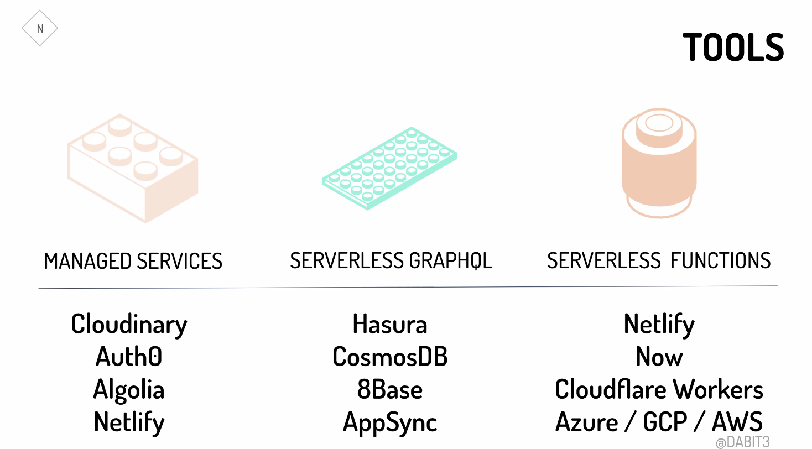
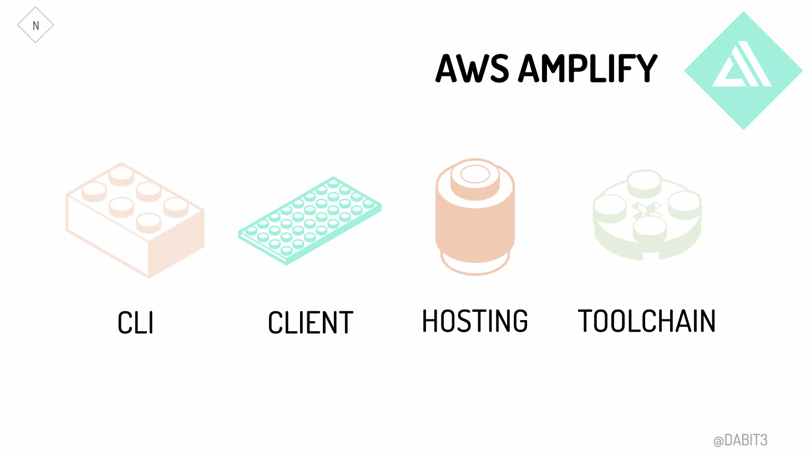
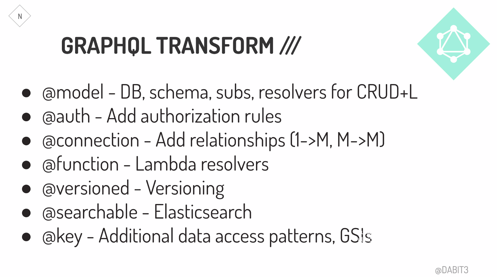

# Egghead Talk Notes: Full Stack Development in the Era of Serverless Computing by Nader Dabit

## Links

- [Nader Dabit](https://twitter.com/dabit3)

- This talk introduces a workflow that allows front end developers to build full-stack applications using JavaScript by taking advantage of managed services, implementing real-world features like authentication, managed GraphQL APIs, serverless Lambda functions, & chatbots using a CLI based workflow.

## Abstractions

- Take advantage of abstractions.
  - **Old Frontend abstractions:** HTML, CSS, JQuery
  - **New frontend abstraction:**HTML, CSS, JS, Frameworks, Webpack, Client Caching, PWA...
    - Complexity is due to high quality out of top companies, multiple targets, increased user expectations, more powerful devices.

# What's next?

- Initially cloud infrastructure. Now serverless. **What's next?**
- [Cloud Computing Simplified - A Berkeley View on Serverless Computing](https://www2.eecs.berkeley.edu/Pubs/TechRpts/2019/EECS-2019-3.pdf)
  - Summary:
    - More BAAS storage services (MongoDB)
    - Serverless becomes simpler (Zeit, Netlify)
    - Serverless becomes cheaper then serverful
    - Serverful becoming relatively less important
    - Serverless computing becomes the default computing paradigm of the cloud era`

## How To be "More Serverless"

- Intentional use of managed services
- Use Serverless functions to fill in gaps
- Use Custom client SDK's for API interactions
- Use GraphQL as the main data source
- Use service-full service
  - No server operations, essentially codeless, assume responsibility
  - Example: Cloudinary, Auth0, Algolia, Netlify, Amplify
- Use GraphQL
  - Data graph is a menu due to microservices
  - Front and backend sync
  - Asking for the data that you need

## Assumptions

- Agility is a key market differentiator
- Code is a liability
- **Front-end skillset increasingly valuable**
- A deliberate focus on not reinventing the wheel

## Benefits

- Frontend developers move faster = **increased developer velocity and efficiency**
- Decreased complexity
- More secure, reliable, scalable

## Building Serverless

- **Tools:**

- **Amplify:**

- **GraphQL:**

## Examples

- [Conference in a Box](https://github.com/dabit3/conference-app-in-a-box)
- [JamStackCMS](https://www.jamstackcms.io)

# Summary

## The future:

- Lines blurred between the front end and full-stack, everyone is full-stack serverless in the future
- Front end skillset increasingly valuable
- **Serverless becomes default computing paradigm**
- **Teams organized by feature vs platform, stack**

## Drawbacks:

- Increased risk when service is not available
- Working on the bleeding edge
- Vendor lock-in
