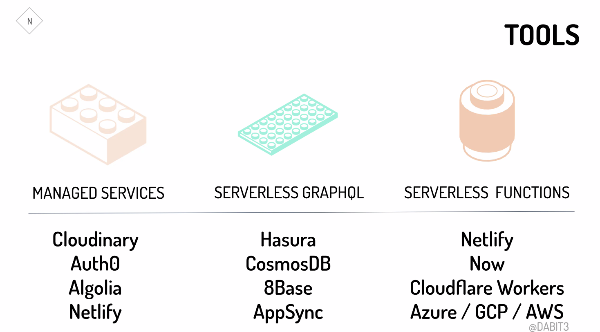
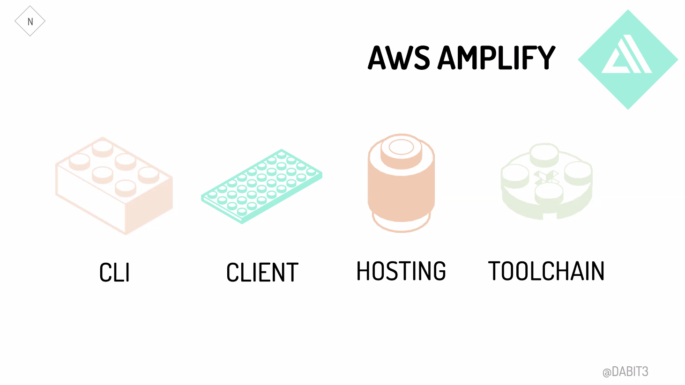
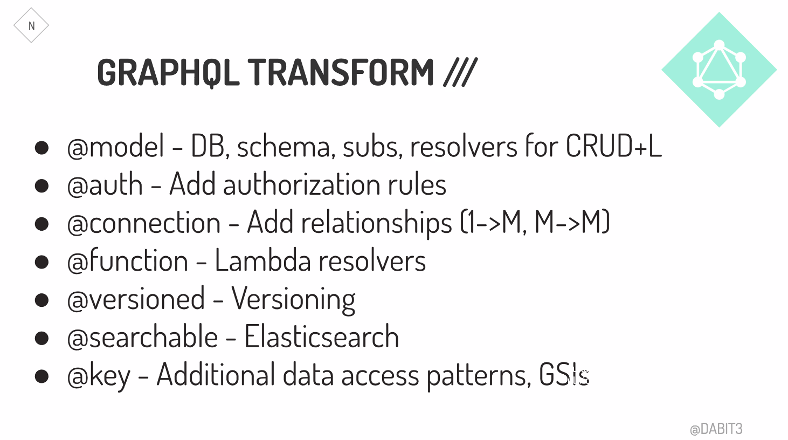

# Egghead talk notes: Full Stack Development in the Era of Serverless Computing

By [Nader Dabit](https://twitter.com/dabit3)

- This talk introduce a workflow that allows front end developers to build full stack applications using JavaScript by taking advantage of managed services, implementing real-world features like authentication, managed GraphQL APIs, serverless Lambda functions, &amp; chatbots using a CLI based workflow.

## Abstractions

- Take advantage of abstractions.
  - Old Frontend abstractions: HTML, CSS, JQuery
  - New frontend abstraction: HTML, CSS, JS, Frameworks, Webpack, Client Caching, PWA...
  - Complexity is due to high quality out out of top companies, multiple targets, increased user expectations, more powerful devices.

# What's next?

- Initially cloud infrastructure. Now serverless. **What's next?**
- Serverless (Cloud Computing Simplified - A Berkeley View on Serverless Computing)
  - More BAAS storage services (MongoDB)
  - Serverless becomes simpler (Zeit, Netlify)
  - Serverless becomes cheaper then serverful
  - Serverful becoming relatively less important
  - Serverless computing becomes the default computing paradigm of the cloud era

# How To be "More Serverless"

- service-full + functions as a service
- tighter correspondence between resources used and resources billed
- smaller & more abstracted control plane
- service-full service
  - No server operations, essentially codeless, assume responsibility
  - Example: Cloudinary, Auth0, Algolia, Netlify, Amplify
- GraphQL
  - Data graph is a menu due to microservices
  - Front and backend sync
  - Asking for the data that you need

# Full Stack Serverless

- Intentional use of managed services
- Serverless functions to full in gaps
- Custom client SDK's for API interactions
- GraphQL as main data source

## Assumptions

- Agility is a key market differentiator
- Code is a liability
- Front-end skillset increasingly valuable
- Deliberate focus on not reinventing the wheel

## Benefits

- Frontend developers move faster (increased developer velocity and efficiency)
- Decreased complexity
- More secure, reliable, scalable

## Building Serverless

- Tools:

- Amplify:

- GraphQL:

## Examples

- [Conference in a Box](https://github.com/dabit3/conference-app-in-a-box)
- [JamStackCMS](https://www.jamstackcms.io)

## Summary

## The future:

- Lines blurred between front end and full stack, everyone is full stack serverless
- Front end skillset increasingly valuable
- **Serverless becomes default computing paradigm**
- **Teams organized by feature vs platform, stack**

## Drawbacks:

- Increased rick when service is not available
- Bleeding edge
- Vendor lock in
